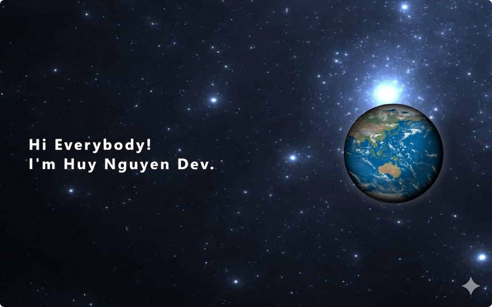

# 👋 Hi there, I'm Huy

🎓 Software Engineering Student at Quy Nhon University
💻 Frontend Developer (Angular / React / Next.js)
🚀 Passionate about building modern web applications

---

## 🛠 Tech Stack

### 🎨 Frontend

* Angular, React, Next.js
* HTML, CSS, JavaScript, TailwindCSS

### ⚙️ Backend (Basic)

* ASP.NET Core
* Java Spring Boot

---

## 🚀 What I'm Doing

* Building real-world projects with Angular & .NET
* Learning clean architecture & scalable systems
* Improving UI/UX and performance

---

## 🔥 Featured Project

### 💼 GiaoThoaTech Platform

* **Role:** Frontend Developer

* **Tech:** React, Next.js, TailwindCSS

* 🔗 **Live Demo:** https://giaothoatech.cloud/vi

* **Description:**
  Developed and maintained a real-world web platform, focusing on modern UI and performance optimization.

* **Responsibilities:**

  * Built responsive UI with Next.js
  * Integrated RESTful APIs from backend
  * Improved UI/UX for better user experience
  * Collaborated with backend team

---

---

## 📊 GitHub Stats

---

## 📫 Contact

* 📧 [nguyendangthanhhuy04@gmail.com](mailto:nguyendangthanhhuy04@gmail.com)

---

## 💡 Quote

> “First, solve the problem. Then, write the code.”

<!--
**thanhhuy204/thanhhuy204** is a ✨ _special_ ✨ repository because its `README.md` (this file) appears on your GitHub profile.

Here are some ideas to get you started:

- 🔭 I’m currently working on ...
- 🌱 I’m currently learning ...
- 👯 I’m looking to collaborate on ...
- 🤔 I’m looking for help with ...
- 💬 Ask me about ...
- 📫 How to reach me: ...
- 😄 Pronouns: ...
- ⚡ Fun fact: ...
-->
